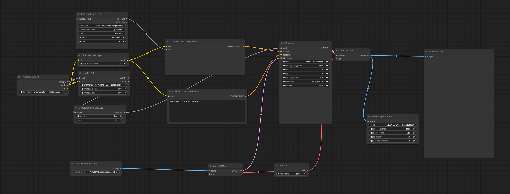
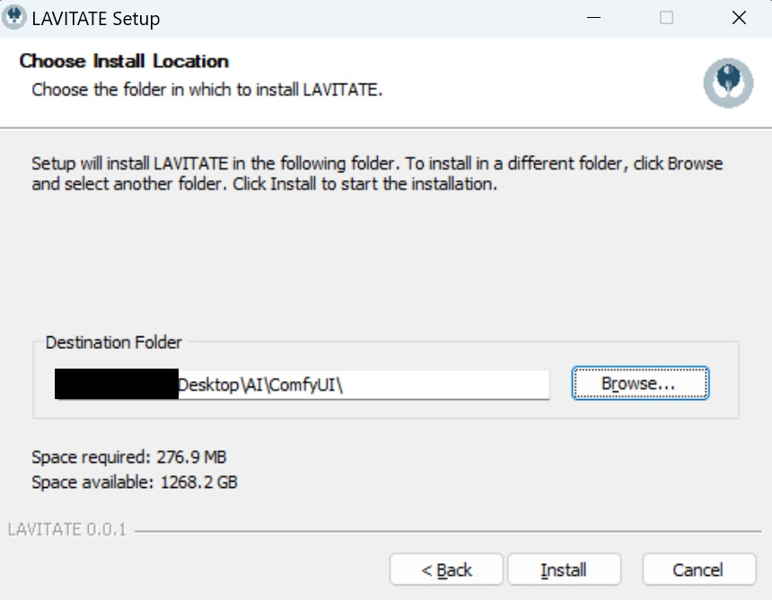

_[Video source](https://www.pexels.com/video/a-woman-holding-a-space-helmet-7169950/) via OBS Virtual Cam with prompt "a woman, looking at a space helmet made from porcelain, blue bird"_

# Preface
Caution: This is an _experimental app_. I created it for myself to have a more pleasant workflow. I'm not a classically trained dev and cannot guarantee that the app works in any environment or that the code is clean by any means. Thus, you run it at your own risk, while I want to highlight that I built the app with no malicious intent. I'm happy for any feedback and/or contributions by potential users and more experienced devs who can identify potential issues with the code, etc.

This app is heavily inspired by toyxyz's ([X](https://twitter.com/toyxyz3)) [ComfyUI Test Nodes](https://github.com/toyxyz/ComfyUI_toyxyz_test_nodes). You may simply resort to their workflow. I simply changed the approach to a standalone app that adds the option of overpainting to paint into the webcam image.

The app was developed with [Electron](https://github.com/electron/electron). Perhaps the JavaScript of this app could be adapted to run directly in the browser.

# Installation
_[Video tutorial coming soon](https://www.youtube.com/@miroxleon)_

I will go through the ComfyUI setup first. For the installation of this app, skip to [Lavitate Installation](https://github.com/miroleon/lavitate?tab=readme-ov-file#install-lavitate).

## Install ComfyUI
You can use this app for other workflows, but it was designed for a specific workflow with [ComfyUI](https://github.com/comfyanonymous/ComfyUI). Therefore, I recommend downloading the embedded version of ComfyUI from the [original repo](https://github.com/comfyanonymous/ComfyUI?tab=readme-ov-file#direct-link-to-download).

## Install Custom Nodes
You will need some Custom Nodes for ComfyUI to run this app with its respective workflow.

### ComfyUI Manager
First, install the [ComfyUI Manager](https://github.com/ltdrdata/ComfyUI-Manager?tab=readme-ov-file#installation) if you haven't already.

### WAS Node Suite
Then install the [WAS Node Suite](https://github.com/WASasquatch/was-node-suite-comfyui?tab=readme-ov-file#recommended-installation). When it comes to the installation of the node's requirements, make sure to run pip in PowerShell.

After installing both custom nodes, it can be helpful to click on the new "Manager" tab in ComfyUI's sidebar and run "Update All".
Then, make sure to drag and drop the workflow PNG below or from this app's directory "LAVITATE\\resources\\workflow" into ComfyUI.

## Model and LoRA
Last, make sure to select your own model and LCM LoRA. I tested the workflow with [CyberRealistic V40](https://civitai.com/models/15003/cyberrealistic) and [LCM-LoRA Weights - Stable Diffusion Acceleration Module](https://civitai.com/models/195519/lcm-lora-weights-stable-diffusion-acceleration-module) and use "taesed" as VAE.

## Install Lavitate
Download the [latest Lavitate release](https://github.com/miroleon/lavitate/releases/tag/0.0.1-pre). This will get you an archive. Unpack the archive, open the folder and run the .exe.
**Important**: The installer will ask you for the installation location. If you want the paths of the workflow to run by default, choose the location of your portable ComfyUI folder. Meaning, if you have the "ComfyUI_windows_portable" folder on your Desktop, select the Desktop as your installation location for this app.

If you have another location for ComfyUI, like \AI\ComfyUI_windows_portable in the image above, install this app into the \AI\ folder. That's it!

# Run the Workflow in ComfyUI
- To start the workflow, click the checkbox "Extra options" in the ComfyUI side panel and then click the checkbox "Auto Queue" to generate assets endlessly. Lastly, click the "Queue Prompt" button.
- To stop the workflow, simply uncheck "Auto Queue".
- Note: If you **didn't** install this app on the same level as the "ComfyUI_windows_portable" folder, make sure to adapt the paths in the ComfyUI workflow.

## Lavitate Controls
- Select your webcam or OBS Virtual Camera etc. in the "Select Input" dropdown menu.
- Set the length of the longest side for the exported frames behind "Output Size". The default value is 512px. Higher values may slow down the rendering in ComfyUI. When the input is too low – this can happen when you type too slow and a value such as "2" is sent to ComfyUI – ComfyUI may return an error. Simply retype your value and send a new Queue Prompt in ComfyUI.
- Draw by having your mouse pressed down.
- Move your drawn path by drag-and-dropping it. Currently, the drag detection isn't great. It helps to grab the drawn shape at the end of the path.
- Move the slider to change the pen size.
- Change the pen color by clicking on the color picker.
- Click "Undo" to undo the last stroke.
- Click "Reset" to clear the canvas.
- Click "Start Capture" to start saving the stream to file. This will override a single file at a framerate of 4FPS.
- Click "Stop Capture" to stop saving/overwriting that one file. Note: this *does not* stop the ComfyUI workflow. ComfyUI has to be stopped individually.
- Click "Output Window" to open the output from ComfyUI in a new window.

# Potential Issues
## Incorrect Paths
If you don't get any output, make sure that you started the capture and that all the paths are correct. This app is supposed to be installed on the same level as the "ComfyUI_windows_portable" folder. Captured frames from this app are saved as "\\LAVITATE\\resources\\saved_frames\\capture.jpg". The output files are read from "\\LAVITATE\\resources\\output\\render.jpg". You may change these paths to your liking, but it requires to adapt the code. Otherwise, make sure that the paths are correct in ComfyUI. You may want to input the absolute paths if you're having issues.

## Using OBS Virtual Camera
At the moment, in order to select OBS's Virtual Camera, it might be necessary to first open LAVITATE and then select OBS Virtual Camera as input. Then, the OBS placeholder screen should appear. _Only then_ open OBS and start the Virtual Camera. If OBS is already open and the Virtual Camera is started, _and then_ LAVITATE is opened, it can happen that no input selection is available.